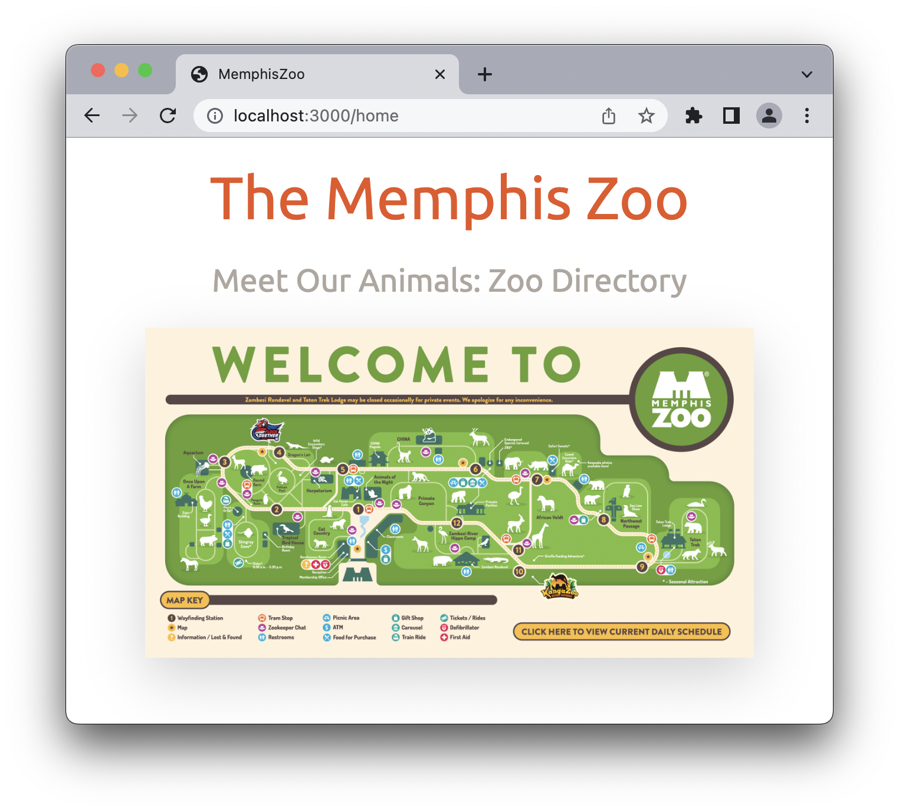
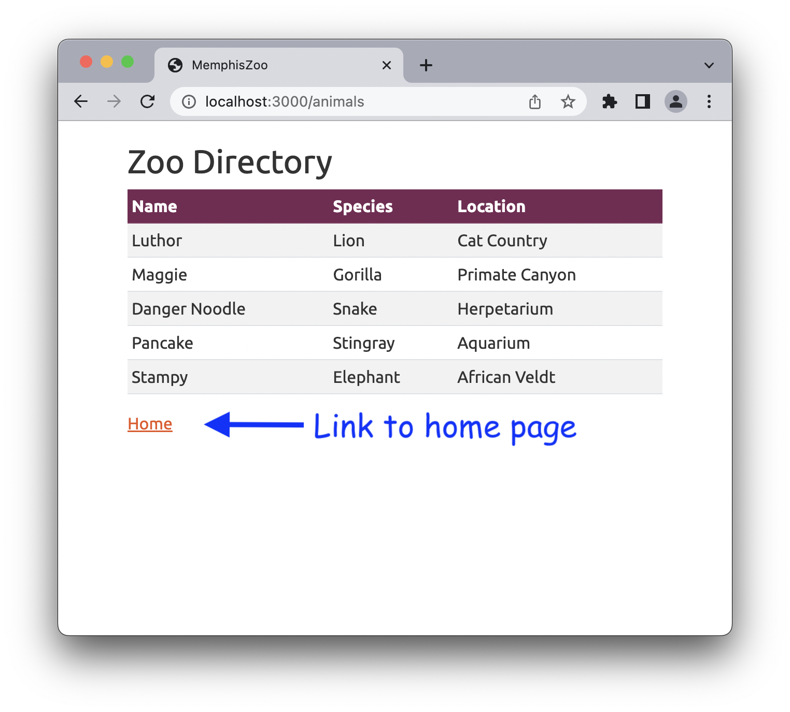
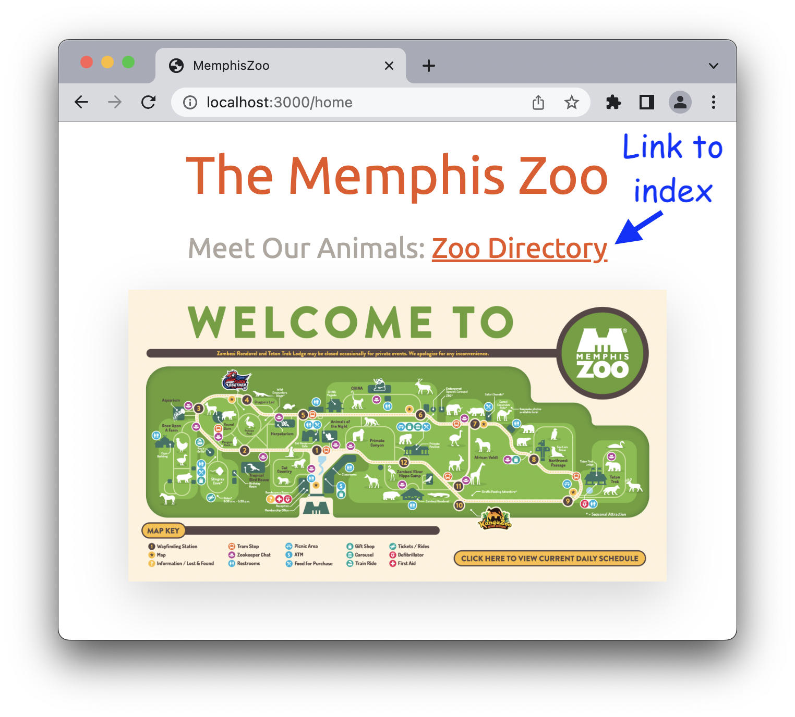

# Skills Test ST1

## The Rules

- Closed neighbor.
- No texting/messaging/posting.
- Referring to the Demos-n-Deets and searching the web is OK.

## Starting the Test

1. **Setting Up Your Repository**:

   **Step 1: Access the GitHub Organization**
   - Log into GitHub and navigate to the organization **um-202480-comp-4081**, which I have created for the class. You can search for it in your GitHub account or use the direct link provided in the course materials.

   **Step 2: Create a New Repository from the Template**
   - Once you are in the organization, click on the **“New repository”** button at the top-right of the page.
   - On the next page:
     - **Owner**: Ensure that the owner is set to **um-202480-comp-4081**.
     - **Repository template**: From the list of available templates, select the **`st1-starter`** template. This will create the repository with the starter code for this assignment.
     - **Repository name**: Name your repository using the following format: `st1-<um-username>`. Replace `<um-username>` with your actual University of Memphis username (e.g., `st1-jdoe`).
     - **Repository privacy**: Set the repository to **Private**, so that only you and your instructors can access it.
   - After filling out these details, click **Create repository**.

   **Step 3: Clone the Repository and Set Up Your Local Environment**
   - After creating the repository, you need to clone it to your local machine and set it up following steps similar to the Running Apps demo. Then you will be ready to start the task.

## About the Base App

Initially, the base app contains the following:

- A `PagesController` controller class.
- The route, controller action, and view template for a home page.
- A root route that redirects to the home page.

If you run the base app and open <http://localhost:3000> in your browser, the following page should be displayed:



## Tasks to Perform

1. **Model Class.** Create an `Animal` model class as per this class diagram (don't worry about adding attribute validations):

    ```mermaid
    classDiagram
        class Animal {
            name : string
            species : string
            location : string
        }
    ```

2. **Seed Data.** Add the following seed data to the seeds file, and then seed the database (to save you time, I've written the data in the form of partially complete code that you can copy and paste):

    ```text
      name: 'Luthor',
      species: 'Lion',
      location: 'Cat Country'

      name: 'Maggie',
      species: 'Gorilla',
      location: 'Primate Canyon'

      name: 'Danger Noodle',
      species: 'Snake',
      location: 'Herpetarium'

      name: 'Pancake',
      species: 'Stingray',
      location: 'Aquarium'

      name: 'Stampy',
      species: 'Elephant',
      location: 'African Veldt'
    ```

3. **Index Page.** Create an index page for the Animal model that looks like this, following the standard naming conventions used in the demos (note the URL):

    

    **Important! Do not forget to add a link to the home page!**

    Don't worry too much about the styling of things, but, if you want to make your table look exactly the same as the picture, the table styles are:

    ```HTML
    <table class="table table-striped">
        <thead class="table-dark">
    ```

4. **Hyperlink.** Add a link from the home page to the index page that looks like this:
    

### Detailed Specifications

- **Feature: Learn About the Memphis Zoo**
  - **User Story**:
    - As a visitor,
    - I want to discover interesting information about the zoo
    - So that I feel connected and engaged with the site
  - **Scenario**: Viewing the zoo's information page
    - Given I am on the /home page
    - Then I should see an `h1` element with text "The Memphis Zoo"
    - And I should see a `p` element with text "Meet Our Animals:" and a link with text "Zoo Directory"
    - And I should see an image _with a map of the Memphis Zoo_
  - **Scenario**: Redirecting from the root page to the home page
    - When I visit the root URL
    - Then I should be automatically redirected to the /home page
- **Feature: Browse Animals**
  - **User Story**:
    - As a visitor,
    - I want to see a list of animals in the zoo and their locations
    - So that I can choose one to visit
  - **Scenario**: Viewing the animal index page content
    - Given I have created two Animal records
    - And I am on the /animals page
    - Then I should see an `h1` element with text "Zoo Directory"
    - And I should see a table with a header row with headers "Name", "Species", and "Location"
    - And I should see two table body rows with the animals' name, species, and location
    - And I should see a `p` element containing a link with text "Home"
  - **Scenario**: Navigating to the animal index page from the home page
    - Given I am on the /home page
    - When I click on the "Zoo Directory" link
    - Then I should be on the /animals page
  - **Scenario**: Navigating back to the home page from the animal index page
    - Given I am on the /animals page
    - When I click on the "Home" link
    - Then I should be on the /home page

Additional Constraints:

- You must follow the standard Rails conventions:
  - Each page must have a path helper following the standard Rails convention:
    - `/home` is `home_path`
    - `/animals` is `animals_path`
  - `/home` routes to `PagesController#home`
  - `/animals` routes to `AnimalsController#index`
- Links must use the `link_to` helper with the appropriate path helper
  - The scenario "Navigating back to the home page from the animal index page" should use `home_path`
- Model class and attributes must be named as instructed
- 5 seeds must be created as instructed upon seeding
- All HTML tags must be properly closed
- No duplication of `head`/`style`/`body` elements in the rendered HTML

## How to Submit

Once you’ve completed the task and confirmed that all tests pass:

1. **Commit your changes**:
   - Add all your changes:

     ```bash
     git add .
     ```

   - Commit your work with a meaningful message:

     ```bash
     git commit -m "Completed ST1 Task"
     ```

2. **Push your changes to GitHub**:
   - Push your commits to the remote repository:

     ```bash
     git push
     ```

3. **Generate ZIP Archive**:
   - Generate a ZIP archive of your project by running the following command:

     ```bash
     git archive -o ../st1-submission.zip --prefix=st1-submission/ HEAD
     ```

    This command should result in a file `st1-submission.zip` being created in your `workspace` folder. Do not change anything about the command.

4. **Submit to Canvas**:
   - In Canvas, submit:
     - The ZIP file of your repo.
   - **Important!** You do not need to submit anything related to your repo to Canvas. The repo must be owned by the 4081 organization and named as instructed to be graded.
